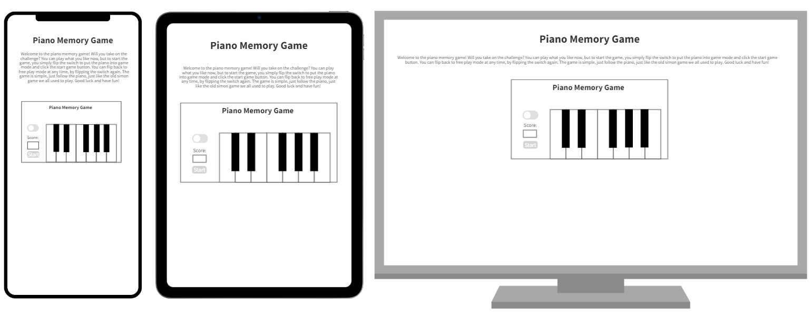
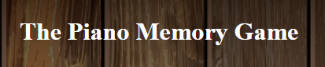
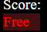
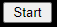
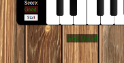
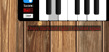
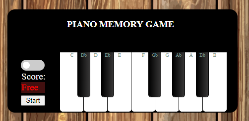
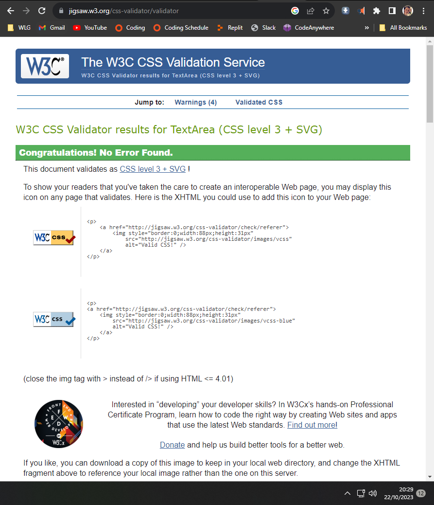
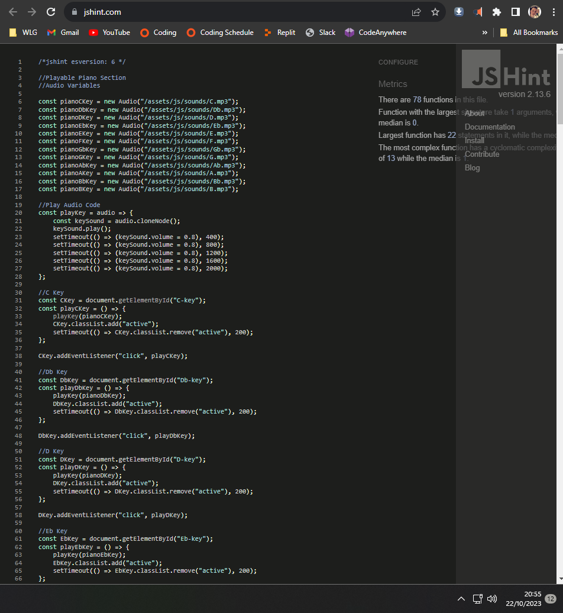

#Milestone Project 2 (Piano Memory Game) Welcome USER\_NAME,

In this document I will explain and expand on my website, 'Piano Memory Game'. The main aim of this website is to give the user the chance to play the piano on the internet for fun, or to test their memory, using the memory game function of the site. To facilitate this the website includes just one index page, with an interactive piano for the user to play on. The user also has access, by the flip of a switch, to a simple memory game, that thay are able to play on the piano. The main user audience for this website will be anybody with an interest in music, or an interest in mini games, as well as people who are bored browsing the web, looking to kill time. There is also a small scope for people who would like to familiarise themselves with the keys on a piano, as the keys are clearly labelled. The website is responsive, so it can be accessed via desktop, tablet and mobile phone.

**Wireframe Images**

The last update to this file was:  22/10/2023

**Live Website**

A live version of the project can be viewed here: 

**User Experience (UX)**

**User stories (New Users, Returning Users, Frequent Users)**

The user stories are divided into three categories:

**New Users**

- As a first-time user, I need to understand the purpose of the website and understand the aim of the game, as well as how to interact with the game.
- As a first-time user, I may also want to kill time, by using the free play option.

**Returning users**

- As a returning user, I will need to remember how to interact with this game, in order to perhaps win the game or beat my score.
- As a returning user, I may also want to kill time, by using the free play option.

**Frequent users**

- As a frequent user, I will gain a familiarity with the way the game works and will hope to see improvement in my memory.
- As a frequent user, I may also want to kill time, by using the free play option.

**Design**

The design of the website is simple and functional, but also sleek and modern. The background colour used on the game's page, is a woooden table. I used this, as I believe most users will want the playing to feel authentic and if users use small pianos like this at home, they will likely be using them at a table or desk. I used normal keyboard colours for the piano, as I wanted play to feel normal and authentic. To add to this authentic aesthetic, I also added a linear gradient to the plack keys, as in real life, black piano keys are often the most reflective. 

**Features**

Heading: This feature gives the user a clear idea of what to expect and gives them an insigth of what is on the page they have arrived at.

Welcome Statement: This section explains the game to the user, allowing them to know how to fully interact with the game and how to use the interface. It also advises how the user can interact with the piano on a free play basis.

Free Play/ Game Switch: This provides the user the ability to switch between free play and game mode, as displayed in the score screen below it, and alows the user to reset the game if there are any problems or they would like to play again..

Score Label and Score Screen: This provides the user information regarding the mode the piano is set to, as well as providing the player's score when game mode is activated. This is linked to the Free Play/ Game Switch and displays the current status of the switch.

Start Button: This provides the user the ability to start a game if game mode is enabled. This does not function if game mode is not enabled.

Correct Messages: These provide feedback to the users, so that they know when they have repeated the sequence correctly. They can be found below the piano and within the score screen. These are green in colour, as red is associated with being correct.

Incorrect Messages: These provide feedback to the users, so that they know when they have repeated the sequence incorrectly. They can be found below the piano and within the score screen. These are red in colour, as red is associated with being wrong.

Keyboard: This is the users point of input and interaction and allows the user to free play in free play mode, or to interact with the game in game mode. 

**Technologies Used**

**Languages Used**

- HTML5
- CSS
- Javascript

**Frameworks, Libraries & Programs Used**

- Git: I used Git for the version control of my code.
- GitHub: I used GitHub for managing my repositories.
- Bootstrap5: I used Bootstrap5 to arrange certain elements of the site.

**Testing**

| **Test** | **Result** |
| --- | --- |
| I used the W3C Markup Validator, W3C CCS Validator and JSHint Services to validate the project to ensure there were no syntax errors in the project. | Results Markup Validator: all pages pass through the validator without errors. There were some warnings regarding some semicolons that were not needed from JSHint, but I resolved these and retested the project with JSHint with no concerns.

**Validation Snippets**

**Testing the User Stories from User Experience (UX) section**:

**New Users**

- As a first-time user, I need to understand the purpose of the website and understand the aim of the game, as well as how to interact with the game. - As a first time user, you are instantly made aware, by the clear heading and the welcome statment, of the aim of the project, as well as how the game works and how to interact with the game. 
- As a first-time user, I may also want to kill time, by using the free play option. - As a first time user, it is made very easy for me to kill time using the free play mode of the game and I can easily test my memory by switching to game mode for further stimulation.

**Returning users**

- As a returning user, I will need to remember how to interact with this game, in order to perhaps win the game or beat my score. - As a returning user, it is easy to remember how to interact with the game and it it is certainly acheivable to win the game, as will as to beat your score. 
- As a returning user, I may also want to kill time, by using the free play option. - As a returning user, it is made very easy for me to kill time using the free play mode of the game and I can easily test my memory by switching to game mode for further stimulation.

**Frequent users**

- As a frequent user, I will gain a familiarity with the way the game works and will hope to see improvement in my memory. - As a frequent user, your familiarity with the game and the interfaces grows quickly and it can certianly help exercise your short term audiographic/photographic memory due to the mixture of audio and visuals.
- As a frequent user, I may also want to kill time, by using the free play option. - As a frequent user, it is made very easy for me to kill time using the free play mode of the game and I can easily test my memory by switching to game mode for further stimulation.

**Bugs Management and Fixes**

| **Bug** | **Fix** |
| --- | --- |
| The piano was not sounding as it should. | It turned out that the audio files were not linked correctly. I tested this by testing each step of the functions used to sound the piano keys when clicked. |
| The piano keys would move upon screen size adjustment. | I set the position for the piano keys to absolute and adopted the use of the margin feature, instead of the positioning features of CSS. This meant the position was being set from within the piano outline, instead of being set from the overall webpage. |
| The level function was not executing as expected after a level win. | It turns out that I had set the check function of the code to empty the computer sequence parameter, so the level function was trying to make the piano call values from an empty array. After removing this from the check function, the game worked as expected. |
| The power switch, that switches the game from free mode, to game mode, was not functioning and was not clickable. | I made the decision for the power button to be moved onto the piano, rather than in the header where it was previously. This solved the issue and improved the syling of the overall game. It turns out another element was overlaying the button in its previous location. I used developer tools on google chrome to fugure this out and apply the fix. |

**Deployment**

**GitHub Pages**  The project was deployed to GitHub Pages using the following steps:

1. I pushed my final code to GIT using VS Code branch tree after finishing the project.
2. I navigated on GitHub to 'Settings'
3. After Settings I navigated to GitHub Pages
4. There I selected 'Deploy from Branch'
5. Then I selected 'Main/(root)' branch

**Credits**

**Code**

- Some of the code is based on examples from the simon game we made in the recent module at Code Institute.
- The code for the toggle switch was borrowed from w3schools (https://www.w3schools.com/howto/howto_css_switch.asp).

**Content**

The content was completely made up by myself, with the exception of a toggle switch, that I borrowed as accredited above.

**Media.**

- All images come from pexels.com copyright free section.

**Acknowledgements**

- I want to thank my tutors for ongoing support in my projects.
- I thank my mentor Mitko for his review and feedback on my project.
- I thank my fellow students for providing help and support via Slack.
- I thank the Code Institute for the training given, providing me with the knowledge to complete this project.

Thank you!